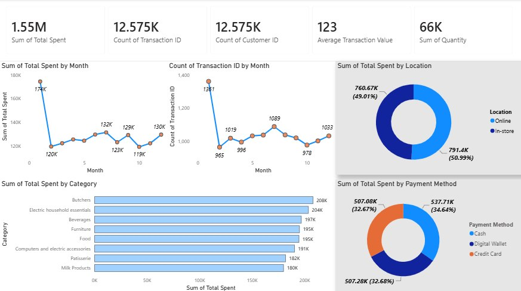
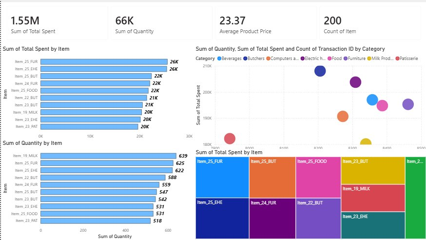
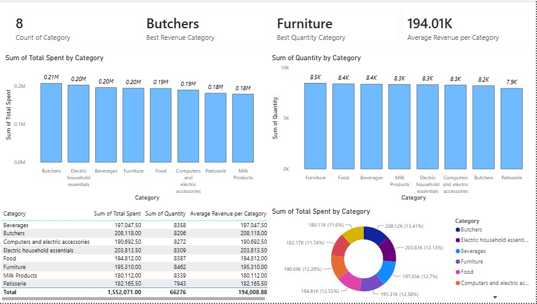
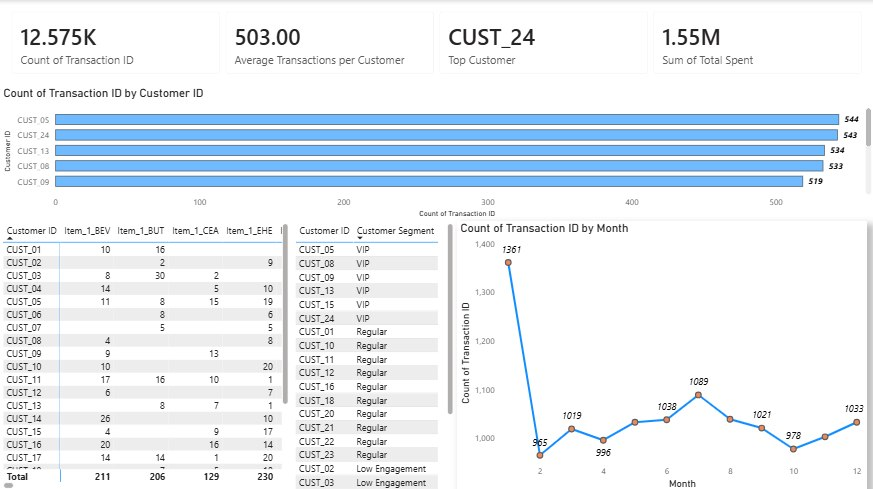
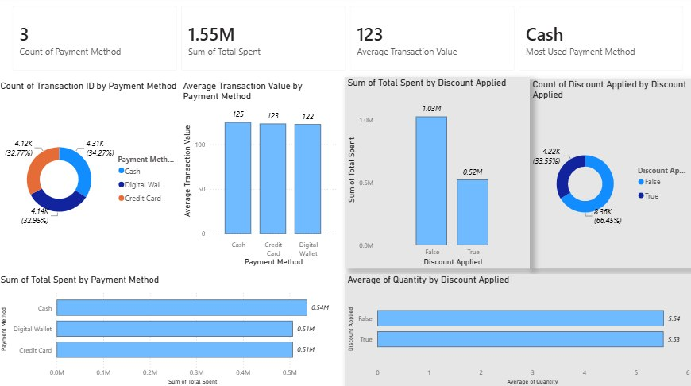
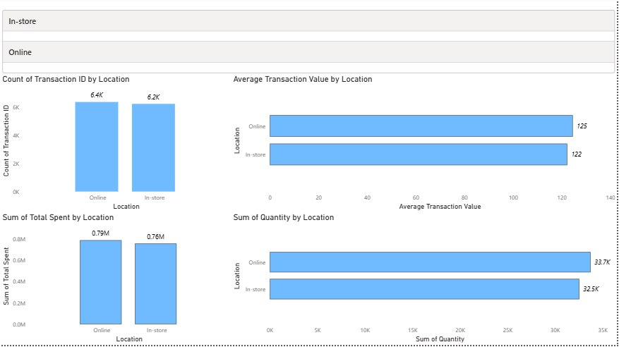
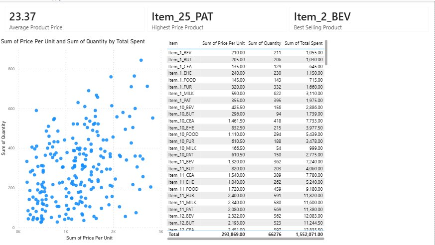

# Retail Store Sales Analysis

##  Overview

This project analyzes retail sales data using **Python** and **Power BI** to uncover customer behavior, product performance, sales trends, and business insights. The project includes data cleaning, exploratory data analysis (EDA), an interactive dashboard, and a business report.

---

##  Dataset

- **Rows:** 12,575
- **Columns:** 11
- **Customers:** 25
- **Products:** 200
- **Categories:** 8
- **Period:** Jan 2022 – Jan 2025

---

##  Tools Used

- Python
- Pandas
- NumPy
- Power BI
- Jupyter Notebook

---

##  Project Workflow

- Data Cleaning
- Exploratory Data Analysis (EDA)
- Business Insights
- Interactive Power BI Dashboard
- Business Report

---

##  Dashboard Highlights

- Executive Overview
- Product Analysis
- Category Analysis
- Customer Analysis
- Payment & Discount Analysis
- Sales Channel Analysis
- Pricing Strategy

---

##  Key Insights

- Generated approximately **1.55M** in total revenue.
- January recorded the highest transaction activity.
- Online sales slightly outperformed in-store sales.
- Premium products generated both high revenue and strong demand.
- Discounts had minimal impact on purchase quantity.

---

##  Repository Structure

```text
Retail-Store-Sales-Analysis/
│
├── data/
├── notebooks/
├── dashboard/
├── report/
├── images/
├── README.md

```

---

## Dashboard Preview

| Executive Overview | Product Analysis | Category Analysis |
|---|---|---|
|  |  |  |


| Customer Analysis | Payment & Discount Analysis | Sales Channel Analysis |
|---|---|---|
|  |  |  |


| Pricing Strategy |
|---|
|  |


---

## Author

**Ayham Alabdallat**
